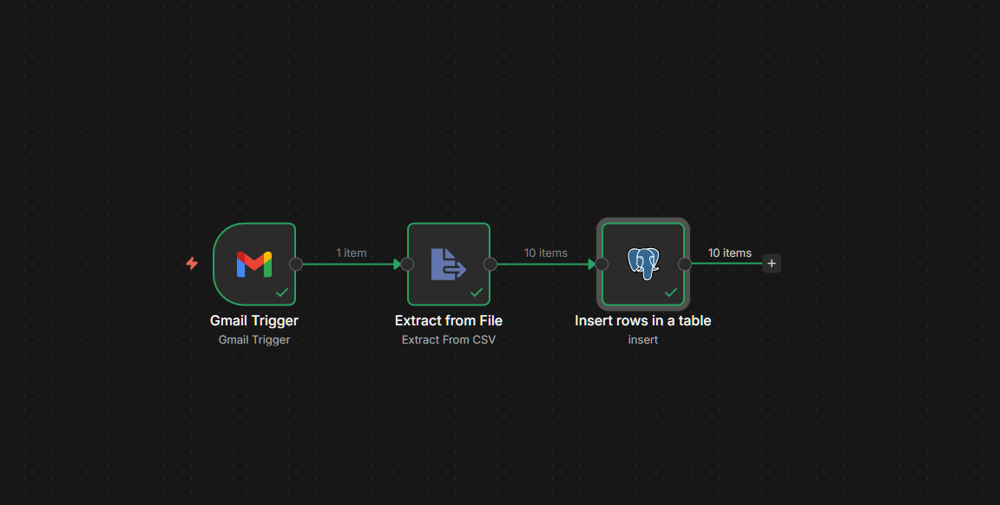
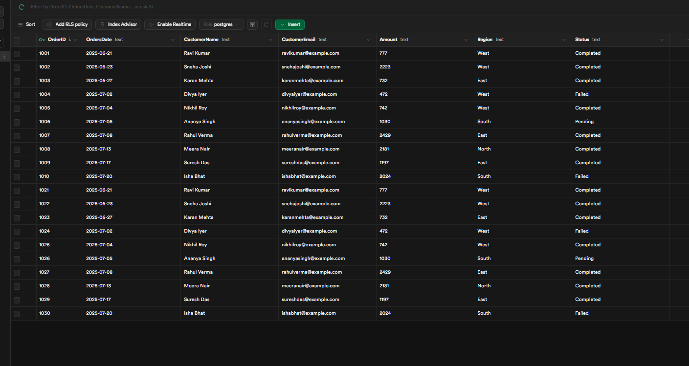
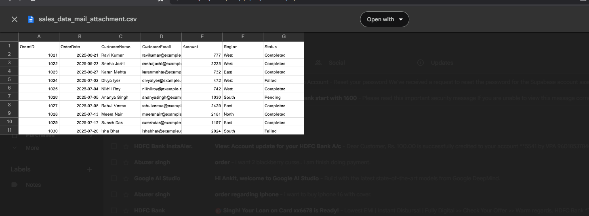

# Data Engineering Project: Automated Gmail-to-Postgres Pipeline

## Project Overview
This project addresses the manual bottleneck of processing data from email attachments. I have developed an automated ETL (Extract, Transform, Load) pipeline that monitors a Gmail inbox for CSV files and syncs the data directly into a Supabase PostgreSQL database.

## System Architecture
The pipeline is orchestrated using n8n and follows a structured data flow:

1. **Extraction Phase:** The Gmail Trigger node identifies new emails with specific attachments.
2. **Transformation Phase:** The binary CSV data is parsed into a structured JSON format.
3. **Loading Phase:** The processed data is mapped and inserted into the target PostgreSQL table.

## Technical Stack
* **Orchestration Tool:** n8n (Self-hosted)
* **Database Management:** Supabase (PostgreSQL)
* **API Integration:** Gmail API via OAuth2 authentication
* **Data Handling:** CSV and JSON Parsing

## Engineering Challenges and Solutions

### 1. Database Connection and Networking
I encountered connection timeouts while linking the local automation engine to the cloud database. To resolve this, I transitioned to a Transaction Pooler using Port 6543, which improved stability.

### 2. Data Cleaning and Formatting
The source CSV files contained currency formatting with commas (e.g., 1,363). I implemented JavaScript expressions to sanitize the strings and convert them into valid integers.

## Implementation Guide
* Import the `workflow.json` file into your n8n environment.
* Enable the Gmail API in Google Cloud Console.
* Create a table in Supabase matching the CSV header structure.

